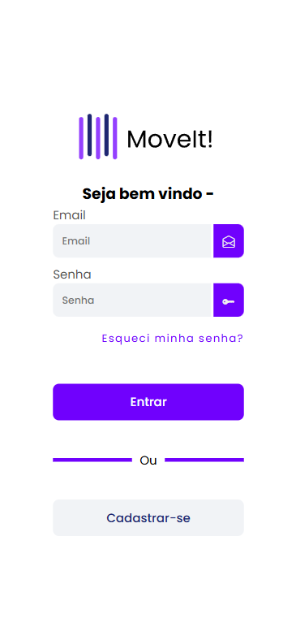
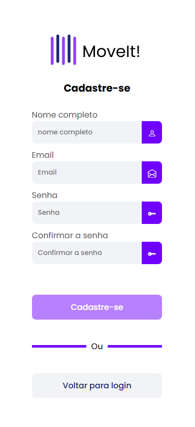

# Projeto Angular com Login

> * Este é um projeto de exemplo para uma tela de login usando Angular 18+ e SCSS.
> * Preparação para API

## Telas

### Desktop

**Tela de Login**

**Tela de Cadastro**

### Mobile

<table>
  <tr>
    <td align="center"><strong>Tela de Login</strong></td>
    <td align="center"><strong>Tela de Cadastro</strong></td>
  </tr>
  <tr>
    <td></td>
    <td></td>
  </tr>
</table>
